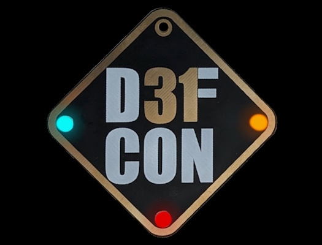
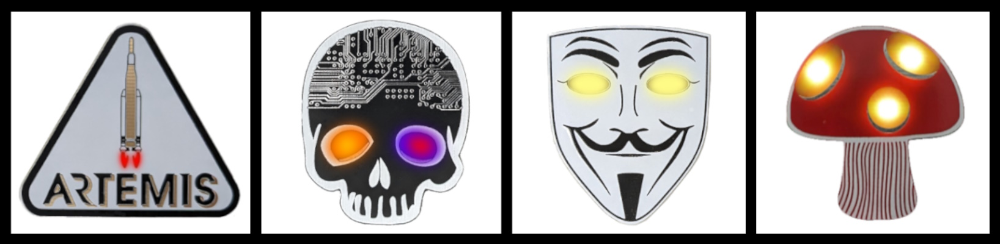
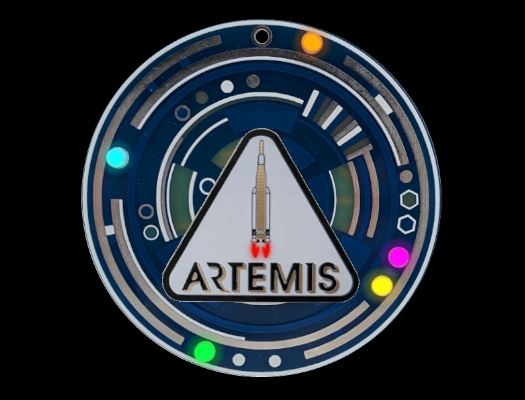
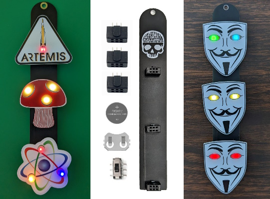

# HackerBoxes @ DEF CON 31
Information for assembly and use of our DEF CON 31 projects.

Explore additional offerings at [HackerBoxes.com](https://hackerboxes.com/).

Always wear safety glasses while soldering, cutting, etc.

Email support@hackerboxes.com for support.

# DEF CON 31 Mini Badge

[Assembly Video](https://youtu.be/Z-F3ssX81bQ)

# Atomic SAO | Space Sloth SAO | Octopus SAO

Atomic SAO: [Assembly Video](https://youtu.be/AWy_B6K0opY)

Space Sloth SAO: Follow video for Atomic SAO minus two LEDs.

Octopus SAO: Follow video for Atomic SAO minus vinyl decal.

# Artemis SAO | BitHead SAO | Guy Fawkes SAO | Shroom SAO

[Assembly Video](https://youtu.be/MpOPoPlyInA)

# Cyber Power Disc Badge

[Assembly Video](https://youtu.be/pNXoxo7XWYw)

# HackerBox SAO Totem

Follow [video for Cyber Power Badge](https://youtu.be/pNXoxo7XWYw) minus LEDs.

Note orientation of SAO Sockets (keying block up) and the suggestion to loosen the SAO sockets if they are too snug.

# Pen Test Toolkit
[Penetration Testing](https://en.wikipedia.org/wiki/Penetration_test) or ethical hacking is an authorized simulated cyberattack on a computer system and possibly physical security systems associated therewith.  The pen test is performed to evaluate the security of the system.  The test can identify vulnerabilities, including the potential for unauthorized parties to gain access to the system's features and data, as well as strengths, enabling a full risk assessment to be completed. 
### RP2040 Inline USB Trap
See the [Inline HackerBox Guide](https://www.instructables.com/HackerBox-0092-Inline/)
### CJMCU-3212 BadUSB
[Online documentation](https://github.com/TheMMcOfficial/CJMCU-3212-wifi_ducky)
### Nordic nRF52840 Sniffer Dongle
[Specifications](https://www.nordicsemi.com/Products/Development-hardware/nRF52840-Dongle)

[nRF Sniffer for Bluetooth LE](https://www.nordicsemi.com/Products/Development-tools/nrf-sniffer-for-bluetooth-le)

[Guide for use with Wireshark](https://novelbits.io/nordic-ble-sniffer-guide-using-nrf52840-wireshark/)

### RF-Nano
The RF-Nano is an Arduino Nano combined with an nRF24L01 radio as described [here](https://flowduino.com/2021/08/24/arduino-nano-r3-nrf24l01-rf-nano/).

When power is first applied to the RF-Nano, its red power LED will blink on and off slowly.

The RF-Nano can be programmed via the Arduino IDE: Select the Tools > Board as Arduino Nano.  Then open the blink example sketch and change both delay values to 100 before uploading the code.  After that, the red LED will blink much faster.

[RF-Nano Operating Instructions](https://michiel.vanderwulp.be/domotica/Modules/RFNanoKeywish/RF-NANO-Operating-Instruction_V.1.1.pdf)

[Mousejack](https://github.com/BastilleResearch/mousejack)

[KeySweeper](http://dangerousprototypes.com/blog/2015/03/23/keysweeper-covert-microsoft-wireless-keyboard-sniffer-using-arduino-and-nrf24l01/)

### Dual Frequency RFID Reader/Writer
See the [Tagger HackerBox Guide](https://www.instructables.com/HackerBox-0072-Tagger/).

See also [PCB Assembly Notes](dualfrequencyrfid.pdf) for the 7941W Dual Frequency RFID.

The two RFID cards marked with "CUID" are 13.56MHz and the two with no marking are 125KHz.

### Locksport Tools
Locksport is the sport or recreation of understanding and defeating physical locks.  See the [Locksport HackerBox Guide](https://www.instructables.com/HackerBox-0032-Locksport/).  
Note The Open Organisation Of Lockpickers (TOOOL) strict code of ethics and please take it seriously.
### I VOID WARRANTIES Iron-On Patch
Design by [Jilles Groenendijk](https://twitter.com/jilles_com)
